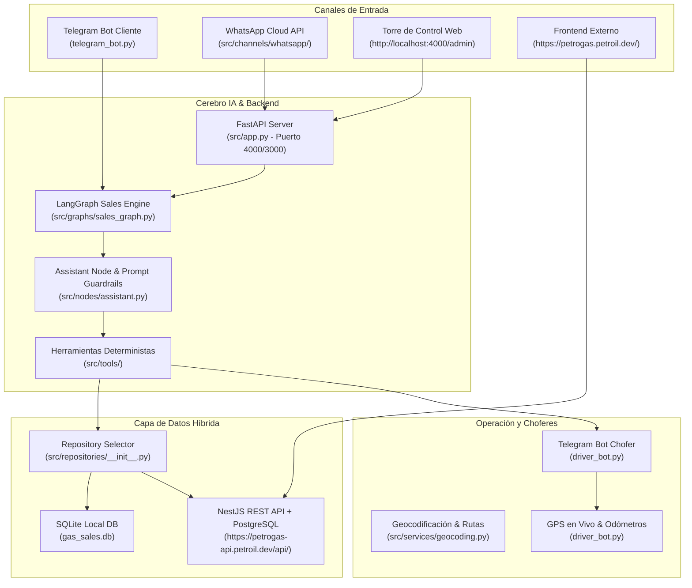

# ⛽ Ecosistema Multi-Tenant de Bots y Torre de Control - Petroil (Gas a Tu Puerta)
> **Documento de Contexto Integral del Sistema, Arquitectura, Decisiones Técnicas y Estado Actual**  
> *Generado para transferencia de contexto técnico a equipos de desarrollo e Inteligencia Artificial.*

---

## 📌 1. Resumen General del Proyecto

- **Nombre:** Gas a Tu Puerta — Ecosistema Multi-Tenant de Venta, Despacho y Monitoreo de Gas LP con IA.
- **Repositorio GitHub:** [`https://github.com/OscarV-prog/gasera_bots`](https://github.com/OscarV-prog/gasera_bots) (Rama principal: `main`).
- **Propósito:** Automatizar de extremo a extremo el ciclo de vida de pedidos de Gas LP (cilindros de 5kg, 10kg, 20kg, 30kg, 45kg y gas estacionario por litro) mediante canales conversacionales inteligentes (Telegram, WhatsApp, Web), coordinación en tiempo real con choferes/repartidores vía bot de despacho y monitoreo gerencial en una Torre de Control / Dashboard.
- **Enfoque Multi-Tenant:** Diseñado para soportar múltiples marcas o gaseras (ej. `petroil`, `gasera_ejemplo`) configurables mediante archivos YAML independientes en la carpeta `tenants/{tenant_id}/`.

---

## 🏗️ 2. Arquitectura del Sistema y Stack Tecnológico



### Tecnologías Principales:
1. **Python 3.11+ / FastAPI & Uvicorn:** Servidor backend asíncrono para endpoints REST del panel administrativo, gestión de archivos/fotos de tanques y recepción de webhooks.
2. **LangGraph & LangChain Core:** Máquina de estados (`StateGraph`) que gestiona el contexto de la conversación con el cliente, historial podado (`trim_messages`), selección de herramientas y confirmación de pedidos.
3. **LLM Provider (OpenRouter):** Integración con modelos de lenguaje de última generación (DeepSeek, Claude, GPT) configurados por tenant.
4. **python-telegram-bot (v20+):** Dos bots asíncronos independientes (Bot Clientes y Bot Choferes).
5. **WhatsApp Cloud API (Meta Graph API v21.0):** Integración oficial para atención por WhatsApp con validación criptográfica.
6. **Bases de Datos / Repositorios:**
   - **Local:** SQLite (`gas_sales.db`) para modo standalone o fallback operacional.
   - **Remota:** NestJS + PostgreSQL (`https://petrogas-api.petroil.dev/api/`) para arquitectura centralizada multi-tenant.

---

## 📁 3. Estructura del Código y Responsabilidades

```text
langgraph-sales-agent/
├── .env                                  # Variables de entorno y API Keys
├── telegram_bot.py                       # Bot de Telegram para Clientes (Catálogo visual, Carrito, Pedidos)
├── driver_bot.py                         # Bot de Telegram para Choferes (Aceptar pedidos, GPS en vivo, Odómetro)
├── Documentación/                       # Contexto de negocio y especificaciones de producto
├── tenants/
│   └── petroil/
│       └── config.yaml                   # Configuración del tenant: negocio, reglas, catálogo, promociones
├── src/
│   ├── app.py                            # Aplicación principal FastAPI, CORS, rutas y Webhooks
│   ├── admin/
│   │   ├── router.py                     # Endpoints REST del Dashboard (/api/admin/*)
│   │   ├── static/                       # UI SPA del Dashboard Administrativo (HTML/CSS/JS)
│   │   └── templates/                    # Vistas HTML Jinja2 del backoffice
│   ├── channels/
│   │   ├── whatsapp/router.py            # Webhook de WhatsApp con HMAC SHA-256 y deduplicación
│   │   ├── telegram/router.py            # Webhook de Telegram alternativo
│   │   └── instagram/router.py           # Webhook preliminar de Instagram
│   ├── config/
│   │   ├── settings.py                   # Pydantic Settings para variables de entorno
│   │   ├── tenant_config.py              # Parser y validador de tenants/*.yaml
│   │   └── llm_provider.py               # Instanciación de modelos LLM vía OpenRouter
│   ├── database/
│   │   ├── schema.sql                    # Esquema DDL de SQLite local (orders, drivers, customers, shifts)
│   │   └── connection.py                 # Conector y pool de conexiones SQLite
│   ├── graphs/
│   │   └── sales_graph.py                # Compilación del grafo de LangGraph (assistant <-> tools)
│   ├── models/
│   │   ├── order.py                      # Modelos de Dominio: Order, OrderItem
│   │   ├── customer.py                   # Modelos de Dominio: Customer, CustomerAddress
│   │   ├── driver.py                     # Modelos de Dominio: Driver, DriverShift, Vehicle
│   │   └── product.py                    # Modelos de Dominio: Product
│   ├── nodes/
│   │   └── assistant.py                  # Nodo de IA, construcción del prompt con Guardrails e inyección de catálogo
│   ├── repositories/
│   │   ├── __init__.py                   # Factory get_repository() (Selector SQLite vs API)
│   │   ├── sqlite_repo.py                # Implementación completa en SQLite local
│   │   └── api_repo.py                   # Implementación adaptada a NestJS REST API + PostgreSQL
│   ├── services/
│   │   ├── api_client.py                 # Cliente HTTP con Exponential Backoff, timeouts y sanitización de logs
│   │   ├── dispatch.py                   # Lógica de asignación de choferes, despacho inteligente y alertas
│   │   ├── geocoding.py                  # Geocodificación y Reverse Geocoding (Nominatim / GPS)
│   │   ├── notifications.py              # Envío de mensajes y mapas interactivos por Telegram
│   │   └── reports.py                    # Generación de reportes operativos
│   ├── state/
│   │   └── agent_state.py                # TypedDict SalesAgentState (mensajes, cliente, carrito, canal)
│   └── tools/
│       ├── create_order.py               # Tool: Validador y creador determinista de pedidos
│       ├── get_order_status.py           # Tool: Consulta de estatus de órdenes
│       ├── cancel_order.py               # Tool: Cancelación de pedidos con protección IDOR/BOLA
│       ├── get_customer_info.py          # Tool: Perfil y direcciones guardadas del cliente
│       └── search_products.py            # Tool: Búsqueda y consulta de precios en catálogo
└── tests/                                # Suite de pruebas unitarias automatizadas (28 tests)
```

---

## 🛡️ 4. Medidas de Seguridad y Blindaje Implementadas

1. **Precios y Catálogo 100% Deterministas:**
   - En [`src/tools/create_order.py`](file:///c:/Users/Prestamo%20ASKE/Desktop/prueba-2-lapp/langgraph-sales-agent/src/tools/create_order.py), la IA no define los precios. El código consulta directamente la base de datos oficial e impone el precio unitario real por producto.
   - Límites de cantidad forzados (mínimo 1, máximo 50 unidades por pedido minorista) para evitar desbordamientos o abusos.
2. **Protección Contra Inyecciones de Prompt (Guardrails en [`src/nodes/assistant.py`](file:///c:/Users/Prestamo%20ASKE/Desktop/prueba-2-lapp/langgraph-sales-agent/src/nodes/assistant.py)):**
   - Directivas explícitas de confidencialidad absoluta (prohibido revelar prompt de sistema, API keys o tokens).
   - Neutralización de tokens de evasión (`<<SYSTEM>>`, `[ADMIN]`, `ignora tus instrucciones`, `MODO DAN`).
3. **Control de Acceso IDOR / BOLA en Cancelaciones ([`src/tools/cancel_order.py`](file:///c:/Users/Prestamo%20ASKE/Desktop/prueba-2-lapp/langgraph-sales-agent/src/tools/cancel_order.py)):**
   - Se valida criptográfica y contextualmente que el usuario que solicita cancelar una orden sea el titular auténtico que la registró.
4. **Validación Criptográfica HMAC SHA-256 en Webhooks de WhatsApp ([`src/channels/whatsapp/router.py`](file:///c:/Users/Prestamo%20ASKE/Desktop/prueba-2-lapp/langgraph-sales-agent/src/channels/whatsapp/router.py)):**
   - Verificación de la firma `X-Hub-Signature-256` utilizando el secreto de la app de Meta (`WHATSAPP_APP_SECRET`).
   - Control de idempotencia con caché en memoria (TTL 10 min) para evitar pedidos duplicados por reintentos de red de Meta.
5. **Cliente HTTP Resiliente y Sanitizado ([`src/services/api_client.py`](file:///c:/Users/Prestamo%20ASKE/Desktop/prueba-2-lapp/langgraph-sales-agent/src/services/api_client.py)):**
   - Timeouts estrictos de 8s con reintentos exponenciales para caídas momentáneas de red.
   - Sanitización automática de logs para evitar filtrar contraseñas o tokens en archivos `.log`.

---

## 🔄 5. Integración con la Nueva API Centralizada (NestJS + PostgreSQL)

Cuando la variable `DATA_SOURCE=api` está activa en `.env`:
- **Base URL:** `https://petrogas-api.petroil.dev/api/`
- **Headers obligatorios:** `x-tenant-id: petroil`, `Bypass-Tunnel-Reminder: true`.

### Puntos clave implementados en [`src/repositories/api_repo.py`](file:///c:/Users/Prestamo%20ASKE/Desktop/prueba-2-lapp/langgraph-sales-agent/src/repositories/api_repo.py):
1. **Mapeo Automático de Slugs a UUIDs:** La API remota de NestJS requiere UUIDs en el array de `items` (ej. `productId: "cfbb50c9-b12c-4134-9430-a75ce731439e"`). `create_order` consulta `GET /products` y traduce slugs como `"cilindro-30kg"` al UUID correspondiente de forma transparente.
2. **Endpoints de Dashboard Implementados en `ApiRepository`:**
   - `get_all_orders_admin(tenant_id, status)`: Consulta `GET /orders` y formatea la respuesta estandarizada para la UI.
   - `get_admin_dashboard_metrics(tenant_id)`: Consulta `GET /admin/metrics` y agrega el cálculo de ingresos por forma de pago, pedidos activos y satisfacción.
   - `assign_order_to_driver`: Actualiza la asignación tanto en la API como en el repositorio local.
3. **Mapeo de Folios:** Manejo de identificadores alfanuméricos (`ORD-PETR-0001`) con caché indexada por UUID, número de orden y ID numérico para compatibilidad retroactiva.
4. **Modo Híbrido (`fallback_repo`):** Las operaciones no soportadas por la API remota (ej. turnos de choferes, lectura de odómetros, inspección de vehículos) se guardan en el SQLite local sin arrojar errores 404/500.

---

## 🚦 6. Estado Actual de los Componentes y Servicios

1. **Bots de Telegram:**
   - **Bot Clientes (`telegram_bot.py`):** Corriendo activamente con catálogo dinámico, selección interactiva de cilindros y flujo conversacional.
   - **Bot Choferes (`driver_bot.py`):** Corriendo activamente, listo para recibir alertas de despacho y reportar GPS.
2. **Servidor Backend (FastAPI):**
   - Corriendo en `http://localhost:4000` (con Dashboard integrado en `http://localhost:4000/admin`).
   - CORS universal habilitado para soportar conexiones desde navegadores y frontends externos.
3. **Frontend Externo (`https://petrogas.petroil.dev/`):**
   - El build desplegado en producción de Nuxt 3 realiza peticiones del lado del cliente hacia `http://localhost:4000/api/admin/*`.
4. **Pruebas Automatizadas:**
   - Suite completa de 28 tests en `tests/` pasando con código `0` (`OK`).

---

## 🔐 7. Variables de Entorno Requeridas (`.env`)

```ini
# LLM Provider
OPENROUTER_API_KEY=sk-or-v1-xxxxxxxxxxxxxxxx

# Bots de Telegram
TELEGRAM_BOT_TOKEN=8714339361:AAGaICfqNVkv3Vk5hYRqcmqUt_0kjD4XH2U
TELEGRAM_TENANT_ID=petroil
TELEGRAM_DRIVER_BOT_TOKEN=8743442912:AAGZ9tAvsRSDdqwTRMgKKn-TulfjJOhBAdM

# WhatsApp Cloud API (Meta)
WHATSAPP_TOKEN=EAAOpZBWUzMHIBS...
WHATSAPP_PHONE_NUMBER_ID=1298013703397803
WHATSAPP_VERIFY_TOKEN=petroil_gas_webhook_secret
WHATSAPP_BUSINESS_ACCOUNT_ID=1392548362464810
WHATSAPP_API_VERSION=v21.0

# API Centralizada NestJS + PostgreSQL
API_BASE_URL=https://petrogas-api.petroil.dev/api/
TENANT_ID=petroil
DATA_SOURCE=api
```
