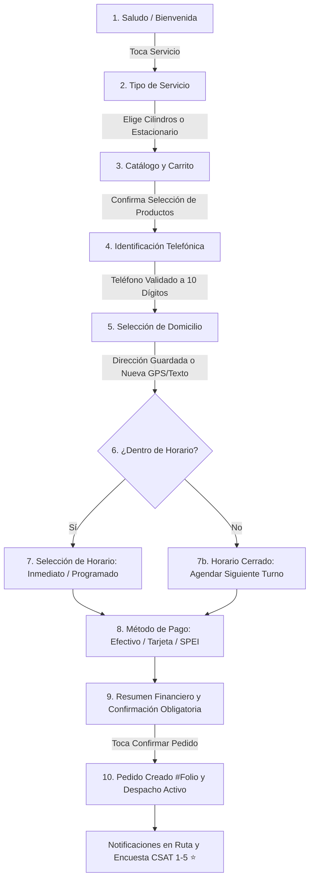
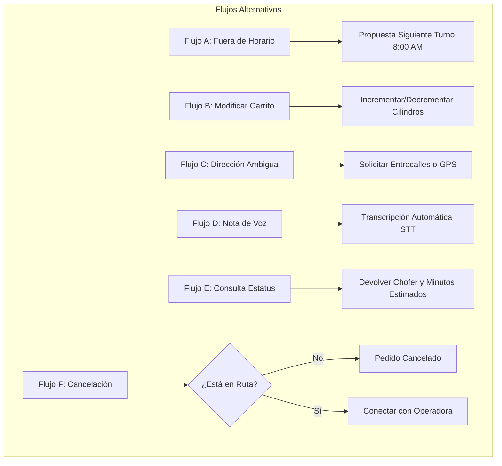

# User Flows & Navigation — Bots de Usuario Omnicanal

**Cliente:** Grupo Petroil — División Gas (Mazatlán, Sinaloa)  
**Versión:** 3.5.0 Enterprise — Consolidada con la Experiencia Real de Usuario en Canales Digitales (Telegram, WhatsApp, Facebook Messenger e Instagram Direct)  
**Estado:** Documento Maestro de Flujos de Usuario Aprobado y Vigente  
**Fuentes Oficiales de Verdad:** `product-context.md`, `prd.md`, `architecture.md`, `telegram_bot.py` y `src/channels/`  
**Fecha:** Octubre 2026  

---

## 1. Propósito y Modelo Canónico de Flujo Conversacional

El presente documento define la arquitectura de navegación y los flujos de interacción del cliente final a través de los cuatro canales de mensajería de Grupo Petroil. Toda interacción se modela bajo el patrón canónico:

$$\text{CLIENTE} \longrightarrow \text{ENTRADA (Texto / Botón / Audio / GPS)} \longrightarrow \text{ROUTER CANAL} \longrightarrow \text{FlowRouter (State Machine)} \longrightarrow \text{RESPUESTA INTERACTIVA}$$

El sistema elimina la incertidumbre de los bots de texto tradicionales mediante una **interfaz híbrida**: navegación táctil estructurada mediante botones, listas y carruseles, combinada con procesamiento de lenguaje natural y voz para solicitudes espontáneas.

---

## 2. Flujo Principal Unificado de Compra (Happy Path de 10 Pasos)



---

### Paso 1: Saludo / Bienvenida
* **Acción del Cliente:** Envía un saludo ("Hola", "Buenas tardes", "/start", audio de saludo o pulsa "Empezar" en Messenger/Instagram).
* **Comportamiento del Bot:**
  - Consulta `IdentityStore` para verificar si existe un registro previo asociado a ese canal o teléfono.
  - Si es cliente conocido: *"¡Hola de nuevo, Don Roberto! Qué gusto saludarte en Gas a tu Puerta de Grupo Petroil. ¿Qué servicio deseas ordenar hoy?"*.
  - Si es cliente nuevo: *"¡Hola! Bienvenido a Gas a tu Puerta de Grupo Petroil en Mazatlán. ¿Qué gas necesitas hoy?"*.
  - Presenta inmediatamente los botones del Paso 2.

---

### Paso 2: Selección de Tipo de Servicio
* **Opciones Presentadas:**
  - `[ 🛢️ Cilindros de Gas ]`
  - `[ 🔥 Tanque Estacionario ]`
* **Transición:**
  - Al presionar `Cilindros`: Transita a `WAITING_FOR_PRODUCT_OR_QUANTITY`.
  - Al presionar `Tanque Estacionario`: Transita a `WAITING_FOR_STATIONARY_DETAILS`.

---

### Paso 3: Catálogo Dinámico y Gestión del Carrito
* **Para Cilindros:**
  - Despliega las capacidades oficiales con precios en vivo desde la base de datos de Petroil:
    * `[ 🟢 Cilindro 30 kg — $670.00 MXN ]`
    * `[ 🔵 Cilindro 20 kg — $447.00 MXN ]`
    * `[ ⚪ Cilindro 45 kg — $1,005.00 MXN ]`
    * `[ 🟡 Cilindro 10 kg — $224.00 MXN ]`
  - Al seleccionar un producto, se suma al carrito temporal (`wa_carts`, `msgr_carts`, etc.) y se muestra el subtotal acumulado:
    ```text
    🛒 Tu selección actual:
    • 2x Cilindro de 30 kg — $1,340.00 MXN
    💰 Total acumulado: $1,340.00 MXN (2 cilindros)
    ```
  - Botones de acción del carrito: `[ ➕ Agregar otro ]`, `[ 🧹 Vaciar Carrito ]`, `[ ➡️ Continuar con el Pedido ]`.
* **Para Tanque Estacionario:**
  - Solicita el importe deseado en pesos o litros (ej. "$800 pesos" o "50 litros", mínimo $500 MXN).

---

### Paso 4: Identificación Telefónica (Ancla de Identidad)
* **Detección Automática por Canal:**
  - En **WhatsApp:** El número se obtiene automáticamente del `wa_id` internacional (ej. `5216691234567` $\rightarrow$ `6691234567`). El bot no interrumpe al usuario pidiéndole lo que ya tiene.
  - En **Telegram:** Se despliega un teclado rápido con el botón: `[ 📱 Compartir mi Teléfono en 1 Toque ]` o la opción de escribir los 10 dígitos.
  - En **Messenger e Instagram:** Se solicita escribir el número celular de contacto a 10 dígitos.
* **Validación:** Se normaliza con regex `^\d{10}$`. Si es inválido, solicita reingresarlo cordialmente.
* **Efecto en Sistema:** Vincula el identificador de la red social con el cliente en `IdentityStore`.

---

### Paso 5: Selección / Ingreso de Domicilio
* **Escenario A: Cliente Recurrente con Direcciones Guardadas:**
  - El bot consulta la libreta de direcciones en la base de datos y despliega botones dedicados:
    * `[ 📍 Casa: Av. Delfín #402, Fracc. Alarcón ]`
    * `[ 📍 Taller: Av. Santa Rosa #105 ]`
    * `[ ➕ Enviar otra dirección ]`
* **Escenario B: Cliente Nuevo o Nueva Dirección:**
  - Se ofrecen dos mecanismos de captura sin fricción:
    1. **Botón de Ubicación GPS Nativa:** En Telegram, WhatsApp y Messenger, el usuario puede tocar `[ 📍 Compartir mi Ubicación GPS ]`. El bot ejecuta geocodificación inversa satelital (`resolve_gps_address_to_name`) y extrae la calle y colonia automáticamente.
    2. **Ingreso por Texto:** El usuario escribe calle, número exterior, colonia y referencias (ej. *"Calle Robalo #214, Fracc. Sábalo Country, casa blanca con portón café"*).
  - El servicio de geocodificación valida las coordenadas en Mazatlán.

---

### Paso 6: Verificación de Horario y Ventana de Entrega
* **Evaluación en Tiempo Real:** El sistema consulta `schedule_manager.py` contra las reglas de horario de Petroil Mazatlán.
* **Si el Centro Operativo está Abierto:**
  - Botones:
    * `[ ⚡ Lo antes posible ]`: Entrega inmediata en el turno en curso (tiempo promedio 30 a 45 minutos).
    * `[ 📅 Programar Entrega ]`: Permite seleccionar fecha y rango de horas específico (ej. "Hoy a las 4:00 PM" o "Mañana de 9:00 a 11:00 AM").
* **Si el Centro Operativo está Cerrado (Fuera de Horario):**
  - Ver Flujo Alternativo A.

---

### Paso 7: Selección de Método de Pago
* **Opciones Presentadas:**
  - `[ 💵 Efectivo ]`: El bot pregunta si requiere cambio (ej. *"¿Pagas exacto o requieres cambio de billete de $500 o $1,000?"*).
  - `[ 💳 Tarjeta Bancaria (Terminal) ]`: Notifica que el repartidor llevará terminal física para cobro con tarjeta de débito o crédito.
  - `[ 📱 Transferencia SPEI ]`: Muestra la CLABE interbancaria institucional de Grupo Petroil y solicita mostrar la captura de pantalla al repartidor al recibir el cilindro.

---

### Paso 8: Resumen Financiero y Confirmación Obligatoria
* El bot presenta una tarjeta estructurada e inalterable antes de proceder:
  ```text
  📋 RESUMEN DE TU PEDIDO — PETROIL GAS
  ═══════════════════════════════════════
  🛢️ Producto: 1x Cilindro de 30 kg
  💰 Total a Pagar: $670.00 MXN
  📍 Entrega en: Av. Delfín #402, Fracc. Alarcón
  🕒 Horario: Lo antes posible (30-45 min)
  💳 Forma de Pago: Efectivo (paga con $1,000)
  👤 Titular: María González (669-123-4567)
  ═══════════════════════════════════════
  ¿Todo correcto para enviar tu unidad?
  ```
* **Botones de Acción:**
  - `[ ✅ Confirmar Pedido ]` $\rightarrow$ Ejecuta `create_order` en base de datos.
  - `[ ✏️ Modificar Algo ]` $\rightarrow$ Despliega menú para editar productos, dirección o pago.
  - `[ ❌ Cancelar ]` $\rightarrow$ Limpia el borrador y finaliza la sesión cordialmente.

---

### Paso 9: Creación de Pedido y Despacho Activo
* El sistema genera el registro transaccional en la tabla `orders`, guarda la relación canal-orden en `IdentityStore` y responde al cliente:
  ```text
  🎉 ¡Tu pedido ha sido confirmado con éxito!
  🏷️ Folio: #10482
  
  Hemos enviado tu orden a nuestra central de distribución.
  Te notificaremos por aquí en cuanto la camioneta vaya en camino a tu domicilio. 🚛💨
  ```

---

### Paso 10: Notificaciones Proactivas y Encuesta CSAT
* **Notificación 1 (Chofer Asignado):** *"🚛 Tu chofer Juan Pérez ha sido asignado en la unidad #14 (Placas: VZ-4821)."*
* **Notificación 2 (En Ruta):** *"📍 ¡Tu repartidor va en camino! Se encuentra a unos minutos de tu domicilio."*
* **Notificación 3 (Entregado):** *"✅ Tu gas ha sido entregado exitosamente. Importe cobrado: $670.00 MXN."*
* **Encuesta de Calidad (CSAT):**
  ```text
  🌟 En Grupo Petroil queremos darte el mejor servicio.
  ¿Cómo calificarías la atención de tu repartidor hoy?
  
  [ ⭐ ] [ ⭐⭐ ] [ ⭐⭐⭐ ] [ ⭐⭐⭐⭐ ] [ ⭐⭐⭐⭐⭐ ]
  ```
  Al seleccionar una calificación, el bot registra la puntuación en la base de datos y agradece la preferencia del cliente.

---

## 3. Flujos Alternativos y Excepciones



---

### Flujo A: Pedido Fuera de Horario Comercial
* **Disparador:** El cliente interactúa fuera de la ventana operativa de Petroil (ej. a las 11:30 PM o domingo por la tarde).
* **Respuesta del Bot:**
  ```text
  🌙 ¡Hola! En este momento nuestras unidades de reparto se encuentran fuera de horario de servicio.
  Nuestro horario de atención es de Lunes a Sábado de 7:00 AM a 7:00 PM y Domingos de 8:00 AM a 3:00 PM.
  
  ¿Te gustaría programar tu pedido para que sea entregado mañana a primera hora (8:00 AM)?
  
  [ 📅 Sí, programar para mañana ]  [ ❌ No, gracias ]
  ```
* **Consecuencia:** Si el usuario acepta, el pedido se guarda en estado `scheduled` para el día siguiente con activación automática en la mesa de agenda.

---

### Flujo B: Edición de Datos Antes de Confirmar
* **Disparador:** En el Paso 8 el usuario presiona `[ ✏️ Modificar Algo ]`.
* **Menú de Edición Desplegado:**
  - `[ 🛢️ Cambiar Productos / Cantidades ]`
  - `[ 📍 Cambiar Dirección de Entrega ]`
  - `[ 💳 Cambiar Forma de Pago ]`
  - `[ 🔙 Volver al Resumen ]`
* El bot regresa al paso específico solicitado, actualiza el objeto `DraftOrder` en memoria y vuelve a generar el resumen financiero actualizado sin perder los demás datos ya capturados.

---

### Flujo C: Envío de Ubicación GPS vs Dirección de Texto
* Si el cliente se encuentra en una colonia de difícil acceso o nueva creación en Mazatlán y Nominatim no arroja número exterior exacto:
  - El bot solicita: *"Ubicamos la colonia, pero para que el chofer no se pierda, ¿podrías indicarnos entre qué calles se encuentra o el color de la fachada?"*.
  - Las notas adicionales se almacenan en `DraftOrder.notes` y se transmiten directamente al chofer en su tarjeta de navegación.

---

### Flujo D: Recepción de Notas de Voz en Cualquier Momento
* En cualquier etapa del flujo, el usuario puede enviar un mensaje de voz en lugar de texto:
  - Telegram: Nota de voz en formato OGG Opus.
  - WhatsApp: Nota de voz PTT (Push-To-Talk) OGG Opus.
  - Messenger / Instagram: Clip de audio en formato M4A / AAC.
* El bot descarga el archivo temporalmente, invoca a OpenAI Whisper y obtiene el texto.
* Si el audio contiene múltiples entidades (ej. *"Ocupo dos cilindros de treinta kilos en la calle Robalo 214 del Sábalo y pago con mil pesos"*), el enrutador procesa todos los campos de golpe y salta directamente al Paso 8 (Resumen Financiero) en una sola respuesta interactiva.

---

### Flujo E: Consulta de Estatus de Pedido ("¿Dónde viene mi gas?")
* **Disparador:** El cliente escribe *"¿a qué hora llega mi gas?"*, *"estatus"*, *"dónde viene la pipa"*.
* **Comportamiento:**
  - El bot busca pedidos activos asociados al teléfono en la base de datos (`get_order_status`).
  - Si el pedido está en estado `assigned`: *"Tu pedido #10482 está asignado a Juan Pérez (#14). Se encuentra cargando cilindros en planta."*
  - Si está `in_route`: *"Tu repartidor va en camino a tu domicilio. Tiempo estimado: 15 minutos."*
  - Si no hay pedidos activos: *"No encontramos ningún pedido activo para este número. ¿Deseas solicitar gas ahora?"* con botón `[ 🛢️ Ordenar Gas ]`.

---

### Flujo F: Cancelación Asistida de Pedido
* **Disparador:** El usuario escribe *"cancelar pedido"* o presiona `[ ❌ Cancelar ]`.
* **Regla de Negocio:**
  - Si la orden está en estado `pending` o `assigned`: Se cancela inmediatamente en base de datos (`cancel_order`), liberando al chofer y confirmando al cliente: *"Tu pedido #10482 ha sido cancelado con éxito."*
  - Si la orden ya está en estado `in_route`: El bot informa: *"Tu unidad de gas ya se encuentra en camino a escasas cuadras de tu domicilio. Para cancelarlo a este punto, te comunicamos con nuestra operadora en Torre de Control."*

---

### Flujo G: Borrado de Dirección de la Libreta del Cliente
* **Disparador:** El usuario indica que ya no vive en una dirección o pulsa `[ 🗑️ Olvidar esta dirección ]`.
* **Comportamiento:**
  - El bot invoca `IdentityStore.mark_address_deleted(phone, address_text)`.
  - La dirección se agrega a la lista de exclusión en disco (`_deleted_addresses`).
  - La próxima vez que el cliente pida gas, esa dirección no aparecerá en el menú interactivo.

---

## 4. Mapeo Visual de Interacción por Plataforma

```
┌─────────────────────────────────────────────────────────────────────────────────────────────────┐
│                              MAPA DE COMPONENTES UI POR PLATAFORMA                              │
├─────────────────┬──────────────────┬─────────────────────────────┬──────────────────────────────┤
│ TELEGRAM        │ WHATSAPP         │ MESSENGER                   │ INSTAGRAM                    │
├─────────────────┼──────────────────┼─────────────────────────────┼──────────────────────────────┤
│ [ 🛢️ Cilindros ]│ [ Lista:         │ [ Carrusel de Tarjetas:     │ [ Quick Replies:             │
│ [ 🔥 Estac.    ]│   • 30 kg ($670) │   Imagen + Título + Botón   │   🛢️ Cilindros               │
│                 │   • 20 kg ($447) │   "Comprar 30 kg" ]         │   🔥 Estacionario ]          │
│ Botones Inline  │   • 45 kg ($1005)│                             │                              │
│ en 2 Columnas   │   • 10 kg ($224)]│ Quick Replies inferiores:   │ Quick Replies deslizables    │
│                 │                  │ [ 💵 Efectivo ] [ 💳 Tarj ] │ horizontales (hasta 13)      │
│ ReplyKeyboard:  │ Botones de 3:    │                             │                              │
│ 📍 Ubicación GPS│ [ ➕ Agregar ]   │ Botón Quick Reply de GPS:   │ Solicitud de texto o         │
│ 📱 Mi Teléfono  │ [ ➡️ Continuar ] │ 📍 Compartir Ubicación      │ dirección con referencias    │
└─────────────────┴──────────────────┴─────────────────────────────┴──────────────────────────────┘
```
